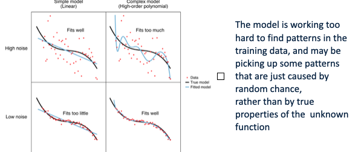
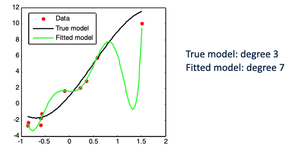
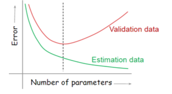

# Introduction to Data Science & AI
-----------------------------------

# **Lecture 1** (5.09.2022, Pietro, DSAI 101)

> #### *_Sciences are primarily defined by their questions, not by their tools!_*


### What is Data Science?
- Sexiest job of the 21st century!
- Why is that?
	- More and more data is being generated
	- There is a growing demand to make sense and understand those data
- Statistics
- Math
- Critical thinking
- **_Asking questions!_**

> Data Science is the discipline that describes, predicts, and makes causal inferences, based on data.   

> Data Science is the process of extracting knowledge or insights from data (structured or unstructured).
>> **Data** -> **Information** -> **Knowledge**

> #### *The value of data is in the impact they have on desision making!*

### What is Artificial Intelligence?
-> Field of study which studies how to create computers and software that are capable of *_intelligent_* behaviour.

### Why.
As a data scientist the best question you can ask yourself is **why**. -> *_Start with the questions, not the data!_*  

- Why has this data been gathered?
- Why am i seeing this?
- Why is it visualised like this?
- Why do i see (or not see) patterns?
- What does this data represent?
- How can i make use of it?
---------------------------------
### The Data Science Process
1. **ASK** an interesting question.
	- What is the scientific *goal*?
	- What would you do with all the *data*?
	- What do you want to *predict* or *estimate*?
1. **GET** the data.
	- How were the data *sampled*?
	- Which data are *relevent*?
	- Are there *privacy* issues?
1. **EXPLORE** the data.
	- *Plot* the data.
	- Are there *anomalies*?
	- Are there *patterns*?
1. **MODEL** the data.
	- *Build* a model.
	- *Fit* the model.
	- *Validate* the model.
1. **COMMUNICATE** and **VISUALIZE** the results.
	- What did we *learn*?
	- Do the results make *sense*?
	- *_Can we tell a story?_*

### first, **DATA**
- raw facts
- recorded symbols
- unprocessed information (either structured or unstructured)
### then, **INFORMATION**
- data in context
- data with meaning, relevance
- refinement of data for the context of human use
### at last, **KNOWLEDGE**
- result of understanding information
- information with direction or intent - it facilitates a decision or an action
- *_Information put into action!_*

### EXAM type exercise
- Given the following situation:
Parking sensors are proximity sensors for road vehicles designed to alert the driver of obstacles while parking.   

a. Explain how a measure of proximity between a road vehicle and an obstacle could be transformed from data into information and then into knowledge.
   
b. Express the knowledge generated at the previous point into a rule which could be implemented into a knowledge-based system.  
> *ad a.*
>
> **Data**: measurments from the sensors (in meters for instance)  
>  
> **Information**: If the distance is < 1 meter, send a signal to the alarm  
>
> **Knowledge**: Alarm goes off alerting the driver  
>   
> *ad b.*
> 
> ```java
> int distance = sensor.read();
>
> if (distance < 1) {
> 	alert();
> }
> ```
--------------
### As a data scientist, your success is dependent on:
> 1. Asking (yourself) the **right questions**
> 1. Your ability to find the **right data** to collect.   
>
> ==IMPORTANT==
> - The methods, techniques, algorithms you are going to use depend on:
> 	1. The (research) question you want to answer.
>	1. The data available to answer that question.
	
-------------
### Exam checklist
[x] definition of data, information and knowledge

[x] link between them

[x] exercises of type above

---
# Lecture 2 (AI 101, Rachel, 6.09.2022)

### The Turing Test

The Turing test is a test of a machine's ability to exibit intelligent behaviour eqiuivalent or indistinguishable from that of a human.

Problems with the Turing test:
- Can improve chances of passing through psychological strategies
- Doesn't test 'intelligence', just responses - chinese room problem
- Humans can 'fail' to convince the judges they are not computers

Advantages of the Turing test:
- Objective notion of intelligence
- Avoids discussion of internal processes and consciousness
- Eliminates the bias in favor of living organisms

Objections to the Turing test:
- Bias toward purely symbolic problem solving task
- Constraining machine intelligence to fit human mold
	- Limited memory
	- Error prone
- Distraction from real-world problems

> With that in mind, human-like behaviour can be and is useful:
> - Entertainment industry
>	- NPC's
> - Human-like Bot Competitions
> - Chatbots giving advice on websites

### CAPTCHA
Captcha is a reverse turing test - tries to pick out the humans from the machines. (getting worse and worse though)

### Total Turing Test
- Original test: No Physical interaction
- Total Turing test:
	- Includes a video signal so the interrogator can test the subject's perceptual abilities
	- Pass Physical Object 'through the hatch'
- Suggested additional components of AI:
	- Computer vision: to percieve objects
	- Robotics: to manipulate and move them
- Completely pass as human:
	- Ex Machina for example

### More to AI than the Turing Test
Views of AI fall into four categories:

| Thinking humanly  | Thinking rationally  |
| *_Acting humanly_*  | *_Acting rationally_* |

The Turing test tests the ones in italics, and they are more important than thinking.

#### Thinking humanly: **cognitive modeling**
- 1960's "cognitive revolution"
	- information-processing psychology
- Requires scientific data theories of internal activities of the brain
- How to validate? Requires
	1. Predicting and testing behaviour of human subjects
	1. Direct identification from neurological data
- Both approaches (Cognitive Science and Cognitive Neuroscience) are now distinct from AI.

#### Thinking rationally: "laws of thought"
- Aristotle: what are the correct arguments/thought processes
- Greek schools developed various forms of *logic*:
*notation* and *rules of derivation* for thoughts
- Direct line through mathematics and philosophy to modern AI
	- The logicist tradition in AI hopes to create intelligent systems using logic programming
- Problems with approach:
	- Not all intelligent behaviour is mediated by logical deliberation (us, humans)
	- What is the **purpose of thinking**? What thoughts **should** i have out of all that i **could** have?
#### Acting rationally
**Rational** behaviour: doing the right thing
- The right thing: that which is expected to *maximize goal achievement, given the available information**
- Doesn't necessarily involve thinking -> reactions/reflexes (reflex action in leg) and automatic behaviours (blinking)

> **Rational programs**
> - For any given class of environments and tasks, seek the program with best performance
> - Caveat: it's never possible to create the perfect (best) program -> Computational limitations

### Foundations of AI
| Philosophy  | Logic, methods of reasoning, rationality  |
|---|---|
| Mathematics  | probaility, formal representaion, computation  |
| Economics  | utility, decision theory  |
| Neuroscience  | physical substrate for mental activity  |
| Psychology  | perception, motor control  |
| CS  | programming, building fast computers  |
| Control theory  | systems that maximize objective function over time  |
| Linguistics  | knowledge representation, grammar  |


### State of the Art
- Autonomous driving
- Logistics planning 
	- 91' Gulf War, US forces used AI logistics planning and scheduling program
	- NASA MAPGEN (Mars exploration rovers)
	- MEXAR2 (mission planning)
- Spam fighting
	- Learning algs classify over a billion messages as spam
- Vacuum cleaning (iRobot)
- Quiz show contestants! (Watson - IBM)

### But AI can't (yet) do all:
- Acting as a judge
- General game playing
- Beating us in soccer
- Conversation successful with another person for an hour
- Machine translation
---
### Exam checklist
- Turing test
	- What?
	- Why?
	- Pros/Cons
- Thinking/Acting  Humanly/Rationally
- Examples of what current AI can/can't do
---
# Lecture 3 (Exploratory data analysis - Fourier analysis/complex numbers, Pietro, 8.09.2022)
### Exploratory data analysis 
- Exploratory data analysis -> an approach to analyzing data sets to summarize their characteristics and start discovering interesting patterns/structure in data.
- Results -> should not be taken as absolute truth, but as a starting point for the development of a scientific hypothesis and further study.
- First thing to do is to explore the data and get a feeling about it:
	- How are the data distributed/organized? (**visualize** your data!)
	- Descriptive statistics (mean, median, range, st. deviation)
	- Outliers?
	- Anomalies?
	- Missing values?
	- Interesting things/structures? (unsupervised learning, clustering, principal components, etc.)
### Visualize your data!
- General principle -> display data as far as possible, show the original data and try not to obscure the design of the study!
- Show as much data/information as possible!

> *Show the data, don't conceal them.*

### Critical/statistical thinking
- Learn to look at features in the data.
- You **must** learn to understand your data, look at them critically.
- Look for features that will help you find the most suitable way to handle, process, and analyze those data.

### Time series data
- TS is a sequence of points -> successive measurements made over a time interval.
- Normally represented as -> quantity/independent variable.
- Independent variable is usually time.

### Patterns in time series
- Tend to come from repetition.
- Need a different representation of the time series -> one that shows the oscillatory patters of a signal - its *_frequency_* content!

### Fourier analysis
- Study of the wat general functions may be represented or approximated by sums of simpler trigonometric functions (sin0 + cos0).
- Time series can be interpreted as "functions".
- Fourier analysis can be used to "decompose" time series into simple patterns (see point 1)
- These building blocks (sin, cos) are **periodic functions** themselves, and can tell us about the oscillatory components/repetitive patterns in a time series.
- Every (literally every possible shape) time-based pattern can be build with circles (FA)

### Complex numbers
- See notebook!;p
---
### Exam checklist
- Complex numbers and their representation in the complex plane
- Cartesian and polar form - plus transformations from one another
- Operations with complex numbers
- Exercises of type like student portal
---
# Lecture 4 (Agents, Rachel, 12.09.2022)
### What is an agent?
- Anything that can be vievew as **percieving** its **environment** through **sensors** and **acting** upon that environment through **actuators**
- Operates *autonomously*
- Humans, robots, softbots, thermostats etc.
- Abstractly [f: P* -> A]

### Examples
Human agent:
- Sensors?
	- eyes, ears
- Actuators?
	- hands, legs, mouth

Robotic agent:
- Sensors?
	- cameras and infrared range finders
- Actuators?
	- various motors
> Mars exploration rovers, Air Traffic Control (OASIS)

### Rational agents
- Should strive to "do the right thing", based on what it can percieve and the actions it can perform
- The right action -> the one that will cause the agent to be the **most succesful**

- Performance measure: An objective criterion for success
	- PM of a vacuum-cleaner agent:
		- amount of dirt cleaned
		- cleanness of the environment
		- amount of time taken
		- amount of electricity consumed
		- amount of noise generated etc.

- For each perception sequence agent should select an action that maximizes its perfomance measure.

- An agent is **autonomous** if its behaviour is determined by its own experience.

### PEAS - Performance measure, Environment, Actuators, Sensors
- First, specify the setting for intelligent agent design
> Example:
> Automated taxi driver:
> - **PM**: Safe, fast, legal, comfortable, maximize profits
> - **Environment**: Roads, other traffic, pedestrians, customers
> - **Actuators**: Steering wheel, accelerator, brake, signal, horn
> - **Sensors**: Cameras, speedometer, GPS, engine sensors, keyboard

### Environment types:
- **Fully observable** -> sensors give it access to the complete state of the environment at each point in time
	- chess, checkers
- **Partially observable**
	- poker, stratego
- **Deterministic** -> fully determined by the current state and action executed
	- chess, stratego
- **Stochastic**
	- dice roll, backgammon, bow n arrow, roulette
- **Episodic** -> divided into atomic "episodes", single action without using memory
	- image analysis, part picking
- **Sequential** 
	- game of chess, poker
- **Static** -> Environment is unchaned while agent is deliberating
	- game of chess, crossword puzzle
- **Dynamic**
	- soccer, taxi driver
- **Semidynamic** -> Environment itself does not change with time but the performance score does
- **Discrete** -> A limited number of distinct, clearly defined percepts and actions
	- chess, poker, backgammon
- **Continuous**
	- taxi driver, soccer, image processing
- **Single agent** -> An agent operating by itself in a given environment
	- crossword puzzle, part picking
- **Multi agent**
	- chess, soccer, taxi driver

> - The environment type largely determines the agent design
> - Real world is: Partially Observable, Stochastic, Sequential, Dynamic, Continuous, Multi-Agent

- **Known** vs **Unknown**
	- The environment of a poker game is **known** (rules)
	- A video game can be fully observable, but you may not know the result of an action until you try.

### Agent types
- Four basic types:
	1. Simple reflex agents
		- action based solely on current percept
		- implemented by conditional statements (if-then)
		- only works when ENV is fully observable, otherwise -> infinite loops
	1. Model-based agents
		- to tackle partially observable ENV
		- update state over time using world knowledge
	1. Goal-based agents
		- needs a goal to know which situations are desirable
		- typically in search and planning research
		- *future is taken into account*
		- more flexible; goals are represented explicitly and can be changed
	1. Utility-based agents
		- goals can be reached in different ways
		- Improves on goals:
			1. select between conflicting goals
			1. select between several goals based on likelihood of success
---
### Exam checklist
[x] What is an agent?
[x] When is it rational? autonomous?
[x] PEAS
[x] Describing environments
[x] Basic agent architectures
---
# Lecture 6 (Data modelling - Linear Regression, Pietro)
### Data modeling - mathematical modeling
- A model is a mathematical representation of a system. An approximation of reality.
- A system is a set of things working together as parts of a mechanism or network; a complex whole
- Model can help people know, understand, or simulate a system the model represents.
- A model may help to explain and make predictions (extrapulate) about the behaviour of a system.
- **A model can be used to investigate how the real world works!**

### Mechanistic vs. Statistical models
- Mechanistic -> tries to model the realtion between input and output of a system by understanding and replicating the individ. components of the system and their interactions. They have tangible, physical aspects.
- Statistical -> seeks only to describe the data, the relation between observed input and output, without trying to replicate the real functioning of the system.

### From data to model - how to build a simple one
- Given the system you want to model and the data you collected about the behaviour of the system.
- Given some knowledge you already have on the bahaiour (theory, data mining, etc.)
- Choose a family of (statistical) models that you think well represents the system
- Find out the optimal values of the parameters of the model given the data you collected.

### Linear regression models
- **y** is the output of the model, i.e., the observations you have collected.
- **x** is the explanatory variable (regressor), a quantity the observations depend on.
- Linear regression is an approach to modeling the relationship between **y** and **x**.

### Overfitting
- Fitting model too complicated with respect to true model.
- Easy to occur with high noise: the model starts describing the random error or noise in data instead of the underlying relationship - it starts to describe exceptions in the data (classification and the curse of dimensionality).  

> 

- Problem of overfitting: model too much dependent on the available observation
- It becomes useless for predicion (highly inaccurate)

> 

### Estimation and validation go together
- A large enough model can reproduce a measured output arbitrarily well. We must verify that the model is relevant for other data - data that were not used for estimation (training the model), but were collected, gathered from the same system.

> 
---
### Exam checklist
- Given the set of correlated var x and y, know how to compute the linear equation of the regression line through the data (y = ax + b)
- Know how to solve exercises as the one given at the end of the lecture.


